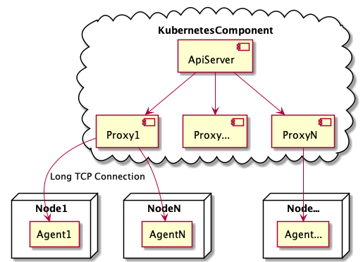
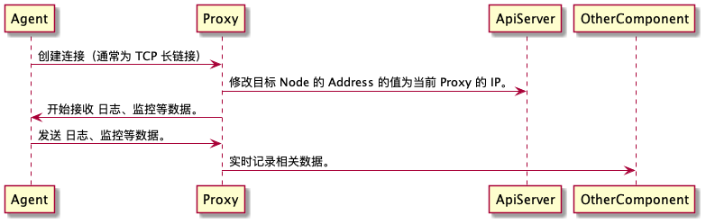
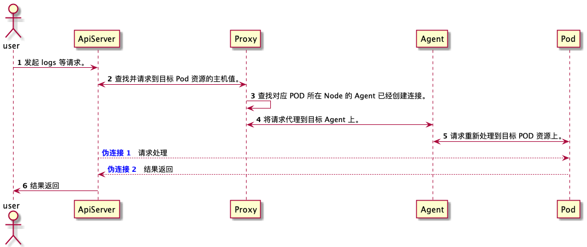
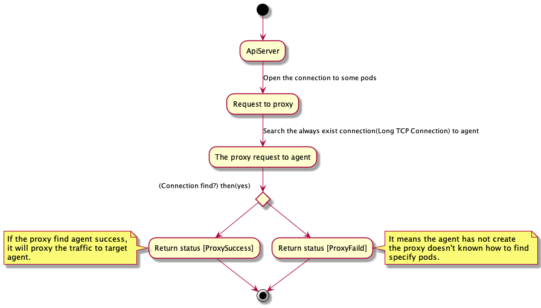

# Proxy 模块

`Proxy` 扩展了 `kubernetes` 中原生的 `proxy` 组件，提供了更加健壮的连接模式，尽可能的保证请求的稳定性。

`Proxy` 尽可能的满足了如下条件：

- 稳定性
- 高可用
- 长链接
- 扩展性

## 模型

> 首先请确保您已经了解过或者深入使用过 `kubernetes` 原生的 `proxy` 组件。

所有 `Proxy` 均在云端，可以被 `ApiServer` 直接请求到。
但是 `Agent` 仅在 `Ndoe` 上存在，并且保证每个 `Node` 仅存在一个 `Agent`。

`ApiServer` 在原生模型中通过 `Proxy` 直接与 `Node` 进行通信。
在 **外交官** 中，我们通过一个额外的 `Agent` 与 `Node` 节点进行通信。
而 `Agent` 与某个 `Proxy` 始终保持长链接，如果发生弱网断网导致连接中断，则认为该节点无法通信。

通过上图可以看到，**外交官** 中会同时存在多个 `Proxy` 组件，而为了保证高可用，`Agent` 仅与其中一个 `Proxy` 建立连接。
如果 `Proxy` 意外死亡，则 `Agent` 需要重新与其他 `Proxy` 建立连接。

### ApiServer 与 PODS 之间通信的逻辑

ApiServer 与 Pods 之间的通信分成两个部分。
#### 1. Pods 所在节点的 Agent 与 Proxy 建立正确连接

#### 2. Proxy 将 ApiServer 的请求代理到目标 Pods 所在的 Node 节点上的 Agent

## 请求检测

在收到 `APIServer` 的请求后，`Proxy` 会尝试寻找到对应 `Agent` 的长链接。

### 规划中的能力
TODO: 尽可能的提供 `Agent` 的自定义和扩展能力，使数据采集、日志回报等功能更加可靠。
- Connect Call Back
- balabala
